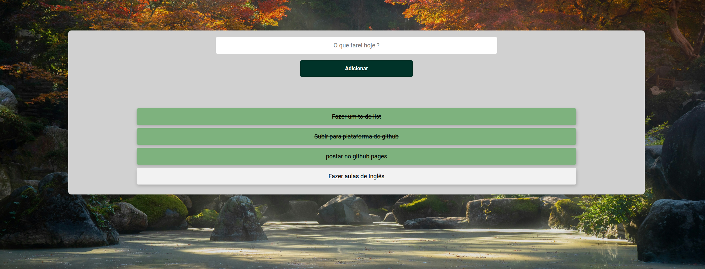

# Meu To-Do List Online

> Uma aplicação web simples e intuitiva para gerenciar suas tarefas diárias.

## Sobre o Projeto

Este projeto é um To-Do List desenvolvido com o objetivo de fornecer uma ferramenta online acessível e fácil de usar para organização pessoal. A ideia surgiu da necessidade de ter uma lista de tarefas sempre à mão, acessível de qualquer dispositivo com um navegador.

A construção desta aplicação envolveu o uso de tecnologias web fundamentais:

* **HTML:** Estrutura a página web, definindo os elementos como a caixa de entrada de texto, o botão de adicionar e a lista de tarefas.
* **CSS:** Responsável pela estilização da interface, tornando-a visualmente agradável e organizada. O design busca ser limpo e intuitivo, facilitando o foco nas tarefas.
* **JavaScript:** Adiciona a interatividade à aplicação. É o JavaScript que permite adicionar novas tarefas à lista, marcar tarefas como concluídas (funcionalidade ainda a ser implementada ou já existente na sua versão), e possivelmente remover tarefas.

## Como Utilizar

1.  **Acessar online:** Após a publicação no GitHub Pages (conforme discutido anteriormente), a sua To-Do List estará acessível através de um link no formato `https://<seu-nome-de-usuario>.github.io/<nome-do-seu-repositorio>/`.
2.  **Adicionar tarefas:** Basta digitar a tarefa desejada no campo de texto "O que fazer hoje?" e clicar no botão "Adicionar". A nova tarefa será adicionada à lista abaixo.
3.  **Marcar como concluída (se implementado):** Futuramente, ou se já implementado, haverá uma forma de marcar as tarefas como concluídas, talvez clicando no item da lista ou em um botão adjacente.
4.  **Remover tarefas (se implementado):** Da mesma forma, poderá haver uma opção para remover tarefas da lista.

## Próximos Passos (Ideias)

* **Persistência de dados:** Atualmente, as tarefas provavelmente desaparecem ao fechar o navegador. Uma melhoria seria implementar a persistência de dados utilizando `localStorage` do navegador ou um backend mais robusto.
* **Marcar como concluída:** Adicionar a funcionalidade visual e lógica para marcar tarefas como feitas.
* **Remover tarefas:** Implementar a opção de remover itens da lista.
* **Edição de tarefas:** Permitir que o usuário edite uma tarefa existente.
* **Filtragem e ordenação:** Adicionar opções para filtrar tarefas (por exemplo, pendentes, concluídas) e ordená-las.
* **Responsividade:** Garantir que a aplicação funcione bem em diferentes tamanhos de tela (desktop, tablet, mobile).

## Publicação no GitHub Pages

Este projeto foi desenvolvido com a intenção de ser publicado de forma gratuita e acessível através do [GitHub Pages](https://pages.github.com/). O processo de publicação envolveu enviar os arquivos HTML, CSS e JavaScript para um repositório no GitHub e habilitar a funcionalidade do GitHub Pages nas configurações do repositório.

## Autor

[Lais Pimente] ([Seu Perfil no GitHub](https://github.com/laispimentel))

---

Sinta-se à vontade para contribuir com este projeto! 😉
